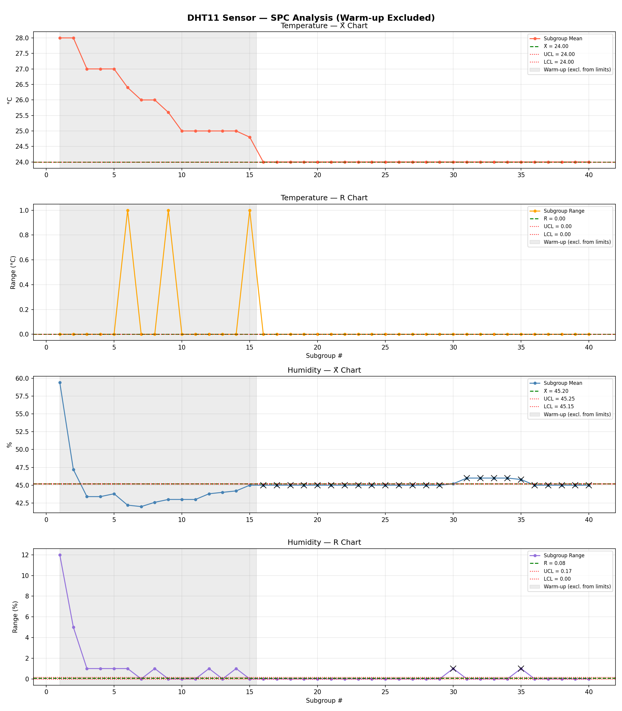
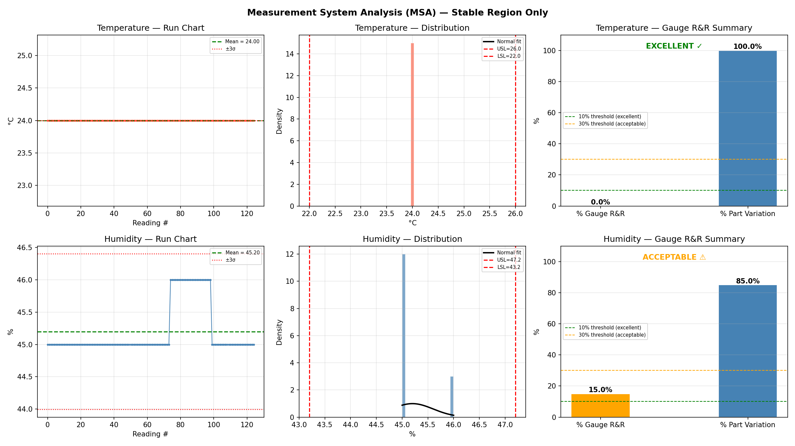

# DHT11 Environmental Monitoring & SPC Analysis

A quality engineering project using an Arduino Mega 2560 and DHT11 sensor 
to collect 200 temperature and humidity measurements and analyze them using 
Statistical Process Control (SPC) and Measurement System Analysis (MSA) 
techniques from Lean Six Sigma methodology.

---

## Hardware

| Component | Details |
|-----------|---------|
| Microcontroller | Arduino Mega 2560 |
| Sensor | DHT11 Temperature & Humidity |
| Temperature Accuracy | ±2°C |
| Humidity Accuracy | ±5% RH |
| Resolution | 1°C / 1% RH |
| Data Pin | Digital Pin 2 |

---

## Project Structure
```
├── arduino_sketch/
│   └── dht11_sensor.ino       # Arduino firmware
├── data_collection.py          # Serial data collection via PySerial
├── spc_analysis.py             # X-bar and R control charts
├── msa_analysis.py             # Gauge R&R and process capability
├── generate_report.py          # Auto PDF report generation
├── sensor_data.csv             # Collected measurements
├── spc_charts.png              # SPC chart output
├── msa_analysis.png            # MSA chart output
└── DHT11_Quality_Report.pdf    # Final engineering report
```

---

## How to Run

**1. Upload Arduino sketch**
- Open `arduino_sketch/dht11_sensor.ino` in Arduino IDE
- Upload to Arduino Mega 2560
- Close Serial Monitor before running Python

**2. Install Python dependencies**
```bash
pip install pyserial matplotlib scipy reportlab numpy
```

**3. Collect data**
```bash
python data_collection.py
```
- Make sure to set the correct COM port in `data_collection.py`
- Data collection takes approximately 10 minutes (200 readings at 3 second intervals)
- Output saved to `sensor_data.csv`

**4. Run SPC analysis**
```bash
python spc_analysis.py
```

**5. Run MSA analysis**
```bash
python msa_analysis.py
```

**6. Generate PDF report**
```bash
python generate_report.py
```

---

## Results & Findings

### SPC Analysis
- 200 readings collected and split into 40 subgroups of n=5
- Warm-up phase identified in first 15 subgroups (~75 readings)
- Control limits calculated exclusively from stable region (subgroups 16-40)
- Temperature process mean: 24.0°C — in statistical control after warm-up
- Humidity process mean: 45.2% — in statistical control after warm-up



### Measurement System Analysis (MSA)
- Temperature Gauge R&R: ~0% → EXCELLENT
- Humidity Gauge R&R: ~15% → ACCEPTABLE
- DHT11 limitation identified: 1°C/1% resolution causes discrete stepping,
  artificially suppressing variation and affecting MSA accuracy
- Recommendation: upgrade to DHT22 (0.1°C, 0.1% RH resolution)



---

## Skills Demonstrated

- Statistical Process Control (X-bar/R charts, UCL/LCL)
- Measurement System Analysis (Gauge R&R, NDC, Cp/Cpk)
- Lean Six Sigma methodology
- Embedded systems programming (Arduino C++)
- Python data analysis (NumPy, SciPy, Matplotlib)
- Serial communication (PySerial)
- Automated PDF report generation (ReportLab)

---

## Limitations & Future Work

- DHT11 resolution (1°C, 1% RH) limits precision for manufacturing applications
- Only repeatability was measured — full Gauge R&R would require multiple sensors
- Upgrade to DHT22 recommended for higher resolution measurements
- Automated warm-up detection could replace manual subgroup exclusion
